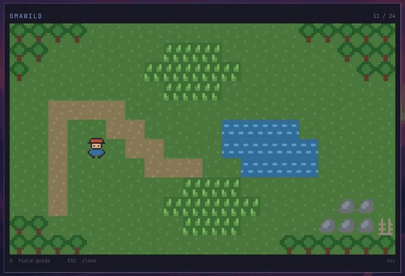
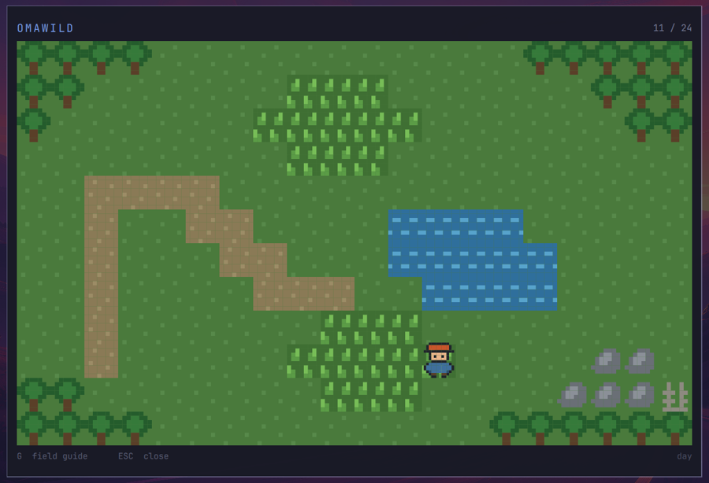
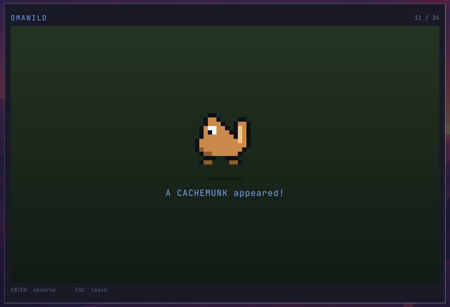
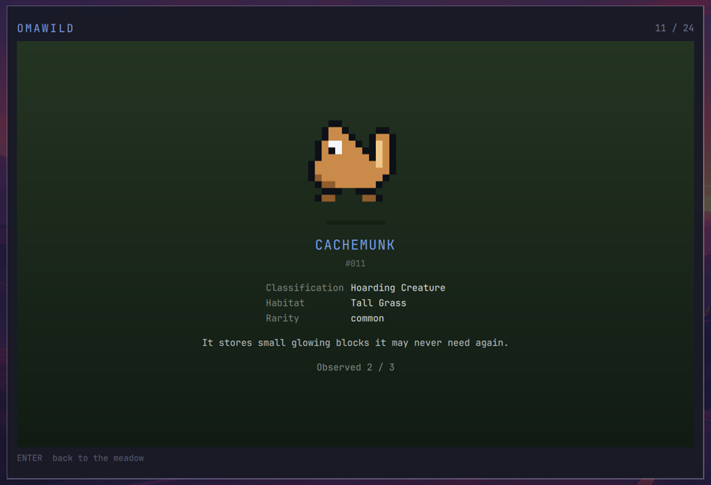
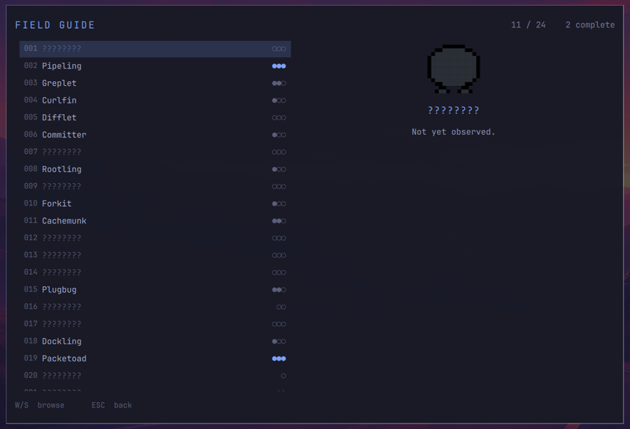

# Omawild

There are strange little creatures hiding inside your computer. Go find them.

Omawild is a tiny creature-discovery game for [Omarchy](https://omarchy.org/). You
walk around a small pixel meadow, step into the tall grass, and something turns up.
You observe it, and your Field Guide fills in a little more.

There is no combat, no levelling, no inventory, no quests, and no account. You are a
naturalist, not a trainer.

Some creatures are simply random. Some only appear because of what your machine is
actually doing right now.



## Install

```bash
omarchy plugin add https://github.com/Raulonastool/omawild.git --enable --yes
omarchy restart shell
```

Then bind a key in `~/.config/hypr/bindings.lua`:

```lua
o.bind("SUPER + N", "Omawild", "omarchy-shell shell toggle raulonastool.omawild '{}'")
```

`hyprctl reload`, press it, and walk into the grass.

> **On the keybind.** `SUPER + G` is the obvious choice, but stock Omarchy already
> uses it for *Toggle window grouping*, and `SUPER + O` for *Pop window out*. `SUPER + N`
> is free on a default install. Pick whatever you like.

> Plugins run as unsandboxed QML inside `omarchy-shell`. Read the source before you
> enable it.

## The meadow



## Playing

| Key | Does |
|-----|------|
| `WASD` / arrows | Walk, one tile per press |
| `Enter` / `Space` | Observe the creature in front of you |
| `Esc` | Leave an encounter, or close the game |
| `G` / `Tab` | Field Guide |
| `W` / `S` in the guide | Browse species |
| `M` | Mute |

> **On `D`.** `WASD` needs `D` for *move right*, so the Field Guide is on `G` and `Tab`
> instead. You cannot have both.

Encounters only happen in tall grass, and not every step. That is deliberate — the
walk is part of it.

## Observing

<p align="center">
  
  
</p>

Most species take three observations to finish. The first tells you almost nothing.
The second fills in classification, habitat and rarity. The third completes the entry.

Rare creatures need fewer observations, because finding one at all is the hard part.



Species you have not met show as `????????` with a blank silhouette. At least one
species does not appear in the guide at all until it turns up.

## The computer is the world

This is the part that makes Omawild worth having on *this* desktop rather than any
other. A small local service samples harmless system state every thirty seconds, and
some species are gated or weighted on it:

| Signal | Used for |
|--------|----------|
| Time of day | Nocturnal species; the meadow's palette shifts through day, evening and night |
| AC vs battery | One creature only appears on battery, another only when plugged in |
| MPRIS playback | One species is eligible only while something is playing |
| Focused window | A browser-loving species |
| System uptime | An elder that needs a machine left running a long while |
| Memory pressure | A creature that likes a full meadow |
| Network reachability | Two water-adjacent species |
| Git working tree | Two species that disagree about uncommitted changes |

The numbers are deliberately not documented. The intended experience is noticing that
something appeared and wondering why.

**None of this leaves your machine.** There is no account, no server, no telemetry, and
no network request — the connectivity check reads the routing table rather than sending
a packet. Omawild works entirely offline.

To point the Git signal at a repository you actually work in, set `gitWatchPath` in
`ui/Context.qml`. It defaults to `~/Work`.

## Creatures

Twenty-four species, all original. Content is data-driven in
[`data/creatures.json`](data/creatures.json), so adding one is a JSON entry rather than
a code change:

```json
{
  "id": "bashling",
  "number": 1,
  "name": "Bashling",
  "archetype": "blob",
  "rarity": "common",
  "terrain": ["grass"],
  "observationsRequired": 3,
  "entries": ["A small creature with a softly blinking tail.", "..."],
  "conditions": { "mediaPlaying": true },
  "modifiers": [{ "when": { "memoryPercentMin": 70 }, "multiplier": 4 }]
}
```

Sprites are character grids in [`js/Sprites.js`](js/Sprites.js) — a shared body
archetype plus a per-species palette. No image files, so a creature costs a few lines
and stays crisp at any scale.

## Your save

Progress lives in `~/.local/state/omawild/save.json` and is written atomically, so
closing the shell mid-step will not corrupt it.

```bash
rm ~/.local/state/omawild/save.json   # start over
```

Nothing else on your system is touched.

## Development

`data/*.json` hot-reloads on save. **Edits to the QML need a shell restart** —
`rescanPlugins` reports the change without re-instantiating the overlay:

```bash
omarchy restart shell
```

Two diagnostics are reachable over IPC once the game is open:

```bash
omarchy-shell shell summon raulonastool.omawild '{}'
omarchy-shell shell call raulonastool.omawild diag ""
omarchy-shell shell call raulonastool.omawild pool ""   # who is eligible right now, and why not
```

`pool` is the quickest way to check a context condition is doing what you think:

```
eligible(17): Bashling:12, Pipeling:12, ... || excluded(7): Bitbat, Voltkit, Mprisprite, ...
```

## Requirements

- Omarchy 4.x (the `omarchy-shell` Quickshell plugin API)
- `QtMultimedia` for sound (the game runs fine without it; you just lose the chimes)

## Licence

Code is MIT — see [LICENSE](LICENSE). The original artwork and audio are CC0 — see
[LICENSE-ASSETS](LICENSE-ASSETS). Every creature, sprite, name, description and sound
was made for this project.
